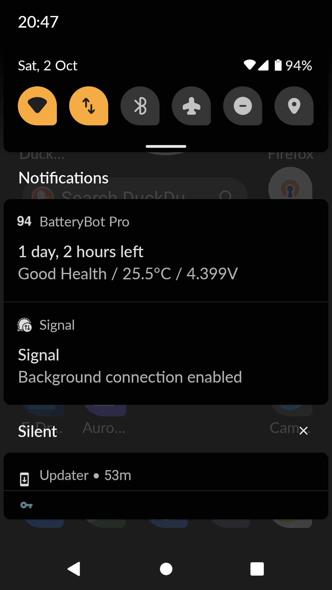

# Lineage on cedric, part 3 (gap discussion and future plans)

- **Date**: 2021-10-02
- **Topic**: Gaps I'm experiencing after a week running LineageOS 18.1 on Motorola Moto G5 "cedric"
- **Outcome**: N/A - Future plans

## Background

I've been running LineageOS 18.1 on cedric for roughly a week, after [fixing the IMEI 0/0 issue on 9/25](cedric-lineage-20210925-imei-00.md).

Most of the time LineageOS works like a dream, especially when I can call on the power duo of F-Droid (many apps being open source) and Aurora (if I absolutely "need" to pull something from the Play store). Probably the one routine annoyance is the stock camera app, which is almost impossible to get "out" of because it hides the soft navigation keys. But I digress.

Two major gaps have arisen that make LineageOS less usable for me than stock Android:
1. Push notifications don't work.
2. The device is totally unable to figure out its location, which renders navigation apps unusable.

The lack of push notifications started out as a minor nuisance in the Signal app but are turning into a major annoyance because they break an application I need to use for my day job.

## Push Notifications (Gap #1)

### Why I need push

The first indication that something was awry with push notifications came when I installed the Signal app.  On initial setup, it had some complaints about how missing Google Play services were somehow going to cause it to drain my battery faster. I ignored it and moved on. Now Signal causes a perpetual notification, which I can't clear, which complains:

> Background connection enabled.

I now realize this is because Signal uses push notifications to tell it when there are new messages it needs to phone home to collect, so that it doesn't have to waste battery polling. I read somewhere, and believe, that Signal uses push in a fairly secure manner: it basically sends an empty message to nudge it into waking up. No real user messages travel over push.



I could live with a slightly subpar Signal experience and an annoying sticky notification, but I now also realize that an app I need to run on the phone for work purposes depends on push to function properly. So there's no getting around it, I need to fix push on cedric.

### The bad news

Android Push notifications are provided by a Google web service called Google Cloud Messaging, go through Google servers, and are distributed as part of the Google Play services package. While it is possible to avoid installing Google Play services *per se*, as far as I can tell, if you want to use the push features of any app that was built to depend on Android push notifications, you have to live with the fact that some communications to you are going through Google's servers, and consequently your device will be phoning home to Google to fetch them.

### What can be done

My understanding is that the [microG](https://microg.org/) project is a free, open source, drop-in replacement for Google Play services, with the added benefit that it simply dummies out some unwanted parts of Google Play services, and allows other parts to be selectively enabled or disabled.

Some problems arise immediately. microG requires a feature called signature spoofing to be enabled, as you can learn from its installation [prerequisites](https://github.com/microg/GmsCore/wiki/Prerequisites) page:

> our System needs to support signature spoofing, see [Signature Spoofing](https://github.com/microg/android_packages_apps_GmsCore/wiki/Signature-Spoofing)

And "pure" LineageOS does not support signature spoofing, being essentially philosophically opposed to it on security grounds.

Possible solutions include:

- There is a fork of Lineage called [LineageOS for microG](https://lineage.microg.org/) which comes with microG bundled. The builds seem to be up-to-date with the regular LineageOS builds.
    - One option is to start over, wipe, and install it. ("Clean install".)
    - There is also a theoretical "dirty migration" path documented in the LineageOS for microG installation guide that allows keeping installed apps and data, but frankly it doesn't seem worth the hassle.
- It is theoretically possible to patch my existing LineageOS installation using a tool like [NanoDroid Patcher](https://github.com/Nanolx/NanoDroid) to enable signature spoofing and unblock a microG installation. However  NanoDroid Patcher only works on Android 10 and below, and LineageOS 18.1 is Android 11, so this path is realistically blocked.

In the end, in my opinion, the right path to get push working is to do a clean install of LineageOS for microG.

### Security considerations

The million dollar question is how much will signature spoofing compromise the device security. As I understand it, it will be minimal. First because it is integrated into the Android permission system, which means you have to grant the permission to particular applications desiring to use it, and the idea is you grant it only to microG. Second, because the microG people have apparently limited it to being usable by system apps.

## Location (Gap #2)

### Device can't find its location!

One of the first things I did after I got LineageOS working is install the OsmAnd app, thinking it would be a good substitute for Google Maps. First thing I do after install is hit the target button to find my house. No dice, error message.

### GPS

I realized the LineageOS was probably missing some of the trickier tricks Google uses to locate the phone by phoning home to the mothership, but doesn't the device have a GPS, and shouldn't it work without Google Location Services?

I installed a GPS testing app from the F-Droid store. My phone could definitely see the satellites. But no location fix.

Some research later, it turns out that because of the ubiquitousness and speed of Google Location Services (and just perhaps other more sinister reasons) many phones ship to eager customers without a working GPS configuration. The GPS hardware works fine, but the software doesn't configure it properly. Because Location Services works so well, nobody notices.

On many, but perhaps not all, Android devices, GPS is configured by a file called `gps.conf`. On my cedric, this file lives at `/vendor/etc/gps.conf`. I pulled a copy from the device, which is accessible [here](gps.conf/cedric-20211001-old-gps.conf). It looks pretty badly wrong to me. Examples:

```
NTP_SERVER=time.izatcloud.net  # DNS doesn't even resolve. Bad start!
...
INTERMEDIATE_POS=0             # Blocks rough quick initial position fixes. Seems like a poor choice.
...
LPP_PROFILE = 2                # This disables LPPe user plane.
```
*etc.* *etc.* There's more. As well, overall, the `gps.conf` seems to be blocking or disabling A-GPS, which is a form of internet-assisted GPS that speeds up satellite lock.

I don't know if this file sources from the stock firmware I installed before Lineage, or Lineage itself. In any event, I think I can do better, and probably get my GPS working, if I hand-write and  test my own `gps.conf`. So that's on the agenda.

### Location Services

I'm never going back to Google Location Services. However, there is no denying they work well.

Since I will be installing microG anyway to get push notifications working, it seems reasonable to consider activating the UnifiedNlp module that comes with microG to get a substitute for Location Services running. 

UnifiedNlp is basically like a stand-in replacement for Location Services which doesn't actually provide any services. Instead it offers a plugin framework that you can install a plugin, called a "backend", for. There are various non-Google options, including plugins sourced off static datasets that don't need the internet to do their thing.

While UnifiedNlp is offered on F-Droid, you can't make it work on vanilla LineageOS, presuambly due to the same signature spoofing issue. But since at this point I'm going down the microG path anyway, I think it's worth trying it out once I have the GPS working.